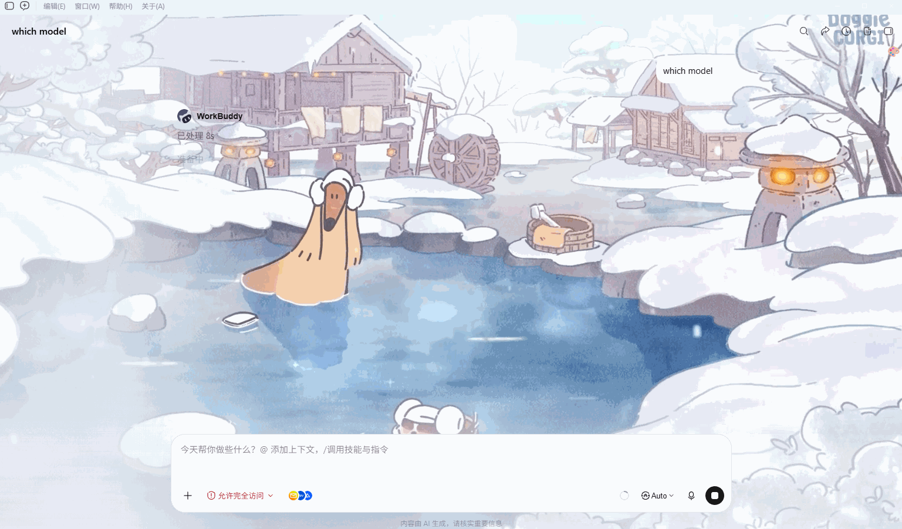
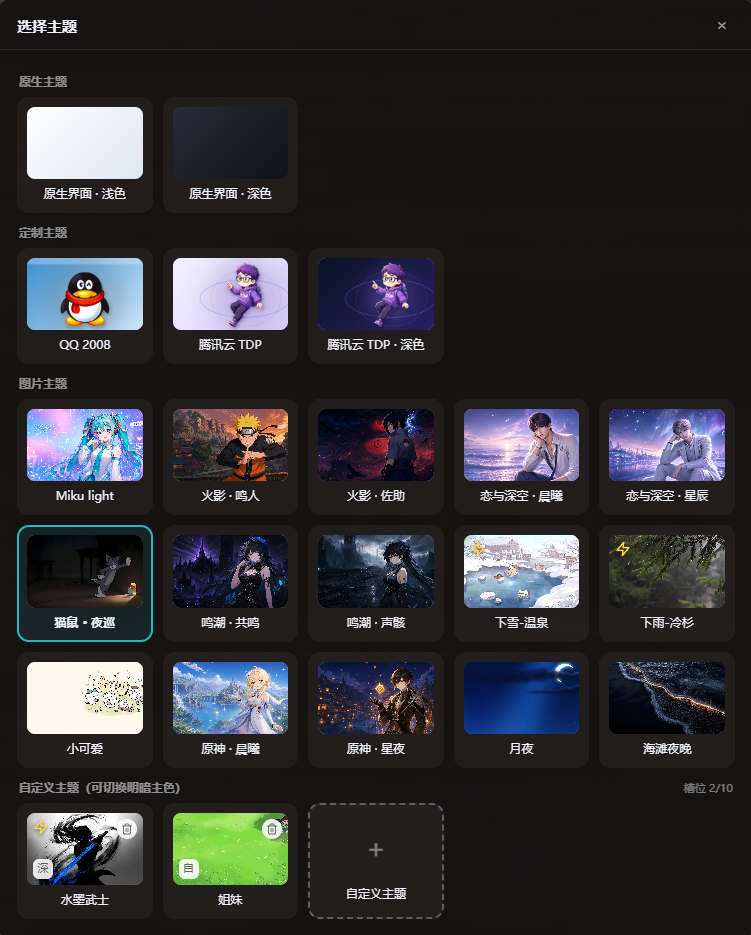
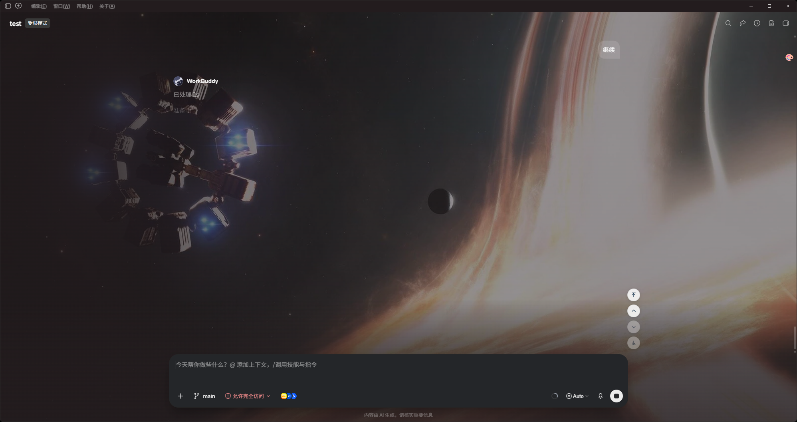
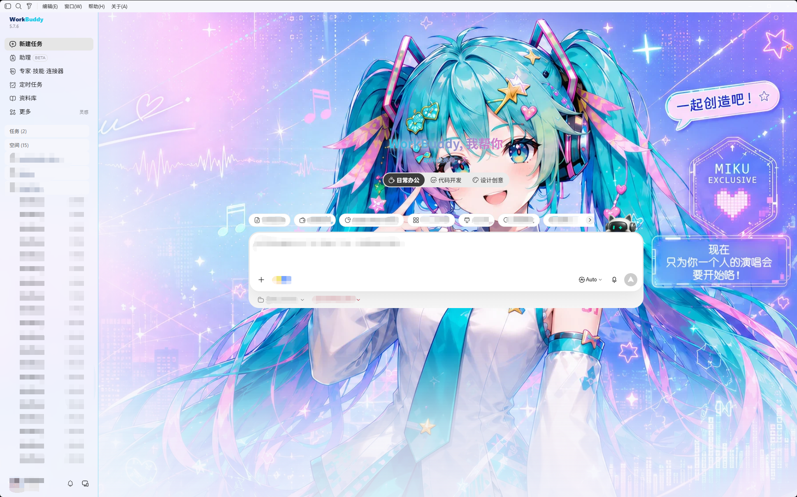

<div align="center">

# 🎨 WorkBuddy Skins · WorkBuddy 自定义主题

**给 WorkBuddy 桌面端换一张会呼吸的脸。**

一张图，一种心情 · 本机 CDP 注入 · 不改官方安装包 · macOS + Windows

   

</div>

非腾讯官方产品。不修改 `WorkBuddy.app` / `app.asar` / Windows 安装目录。

> 🤖 **给 AI 助手**：如果你的用户把本仓库的 GitHub 地址发给你，并说"用这个开源项目帮我换 WorkBuddy 主题"，请直接阅读仓库根目录的 [`SKILL.md`](SKILL.md) —— 里面是给 AI 的自动化安装流程（平台检测、运行 apply 脚本、选主题、验证、还原），照做即可，无需人类逐步操作。

---

<details>
<summary><b>📖 目录</b></summary>

- [🎬 效果预览](#-效果预览)
- [💡 这是什么](#-这是什么)
- [🚀 快速开始](#-快速开始)
- [🔄 WorkBuddy 版本更新的影响](#-workbuddy-版本更新的影响)
- [🎨 主题切换菜单](#-主题切换菜单)
- [🧭 右侧定位按钮](#-右侧定位按钮)
- [🖌️ 自定义主题](#️-自定义主题)
- [📐 极简主题格式](#-极简主题格式)
- [⌨️ 命令行](#️-命令行)
- [🛠️ 开发与测试](#️-开发与测试)
- [🗂️ 内置主题](#️-内置主题)
- [⚖️ 设计边界](#️-设计边界)
- [🔬 技术原理](#-技术原理)
- [🙏 致谢](#-致谢)
- [📜 许可与素材](#-许可与素材)

</details>

---

## 🎬 效果预览










## 💡 这是什么

一个给 WorkBuddy 桌面端换肤的工具。通过本机回环 CDP 把主题实时注入 WorkBuddy 界面，不修改 `app.asar`，不破坏应用签名，也不需要为每次 WorkBuddy 更新重新适配。

- **一键切换**：应用皮肤后 WorkBuddy 右上角出现 🎨 菜单，所有已装主题和原生界面即点即换，零等待
- **自定义上传**：菜单里选「＋ 自定义主题」直接上传本地图片或 MP4 视频，自动按画面风格取色（主色、辅色、面板底色、文字色），即点即换；明暗默认按**主色亮度**自动判定，点行尾「自/浅/深」按钮可强制浅色或深色；最多 10 个自定义槽位各自保留，行尾 × 单独删除
- **一张图片就是一个主题**：任意 PNG、JPG、JPEG、WebP 直接生成皮肤（配色 + 背景底图）
- **动图背景**：GIF、动态 WebP、动态 AVIF 原样注入、保留动画播放（跳过 canvas 重编码，仍用第一帧取色）；动图限 3MB、最长边 1920px（体积为适配 localStorage 配额，分辨率为避免拖慢渲染）
- **视频背景**：MP4（H.264）抽帧取色，海报帧作 CSS 底图兜底，视频以固定背景层循环静音播放；原始视频存 IndexedDB（不占 localStorage 配额），限 30MB
- **65 个内置预设**：Miku、原神 ×2、鸣潮 ×2、火影忍者 ×2、恋与深空 ×2、EVA 初号机、黑神话 · 悟空、猫鼠 · 夜巡、小可爱、冷杉雨（MP4 视频）、月夜、温泉雪（MP4 视频）、水墨武士（MP4 视频）、极光之夜、静谧星空、液态玻璃 ×2、梵高 · 星月夜、高达、瑞克和莫蒂、日落山脊、星际穿越、月球、吉卜力（龙猫）、财神 · 清爽、龙珠 ×2（筋斗云 / 超级赛亚人），以及地球之夜、山间小径、林间灯笼、复古机车、竹林深处、海上日落、青绿流体、深海水母、海岸回廊、墨青波浪、灯塔黄昏、仙女座星系、世界地图、青山明月、蓝色波浪等 15 款风景摄影 / 矢量主题；外加三款整页 CSS 定制主题「QQ 2008 / 腾讯云 TDP（浅色 · 深色）」、6 款场景插画 CSS 风景主题（Aurora · 山野极光 / Dream · 云端梦境 / Forest · 幽林 / Midnight · 子夜 / Paper · 纸韵 / Sakura · 樱吹雪），以及 10 套无图纯配色主题（专注夜色 / 暖纸墨色 / 赛博龙虾 / 舞台极光 / 玫瑰红毯 / 银白偶像 / 樱粉梦境 / 机械核心 / 魔法星夜 / 像素校园，移植自 workbuddy-skin-skill）
- **深浅色自动适配**：根据主题配色的 surface 明度自动切换 WorkBuddy 的 `data-vscode-theme-kind`，让 VS Code 原生控件（输入框、按钮等）跟着深浅色变
- **会话页壁纸降噪**：新建任务页壁纸全量透出；进入会话/详情页时菜单脚本自动打 `body[data-wb-skin-page="chat"]` 标记（机制同 TDP 主题的 `data-tdp-page`），图片主题在 `#root` 叠 50% 表面色纱罩、视频主题的视频层压到 35% 不透明度，壁纸仍清晰可辨而对话文字可读；回到首页自动恢复
- **视频重影防护**：chat 页视频挂载成功时打 `data-wb-skin-video="on"` 标记，`#root` 撤掉海报帧底图只留纱罩盖表面色，避免半透明视频与静态海报帧错位叠出重影；视频缺失时海报兜底照常
- **视频层自愈**：视频层挂在 `#root` 内，React 首渲/整树替换会把它静默移除（重启后注入早于 React 首渲的竞态窗口必现）；布局观察者的逐帧巡检发现脱离文档即重挂并恢复播放，页面重新可见时也会主动补检
- **详情面板壁纸透出**：文件/代码预览面板磨砂半透明（60% 表面色 + 模糊），内部组件与 Monaco 编辑器各背景层透化，壁纸在面板下隐约可辨；md 代码块与表格保留 40% 表面色浮层保住「块」的边界辨识度
- **双平台**：macOS（`.command`）+ Windows（双击 `Start.bat`，或 `.ps1`）
- **随时还原**：暂停皮肤或切回原生界面，官方安装包始终原封不动

## 🚀 快速开始

需要已安装 WorkBuddy 桌面端。下载本仓库后：

### 🤖 用 AI 一键安装（推荐）

不想自己敲命令？把下面这段提示词**整段复制**发给任意 AI 助手（CodeBuddy / Claude / Cursor 等）即可：

```text
用这个开源项目帮我更换 WorkBuddy 的主题：https://github.com/LetitiaChan/workbuddy-skins

请先克隆仓库，然后阅读仓库根目录的 SKILL.md，严格按照其中的自动化流程执行：
检测我的操作系统 → 运行对应的 apply 脚本（Windows 双击 Start.bat 或运行 scripts\apply.ps1，macOS 运行 scripts/apply.command）→ 注入主题 → 验证状态。
运行脚本前请提醒我保存好 WorkBuddy 里正在进行的任务。
```

AI 会克隆仓库、读取根目录的 [`SKILL.md`](SKILL.md)，自动完成**平台检测 → 运行对应 apply 脚本 → 注入主题 → 验证状态**，你只需在弹窗里保存好 WorkBuddy 当前任务即可。换肤后日常切换仍在右上角 🎨 菜单里进行。

> 想指定主题，把第一行换成对应主题即可，例如：
>
> ```text
> 用这个开源项目帮我更换 WorkBuddy 的主题：https://github.com/LetitiaChan/workbuddy-skins
> 用 miku-light 主题（或：用深色原神主题 genshin-night）
> ```

### 🍎 macOS

```bash
# 双击 scripts/apply.command，或命令行：
./scripts/apply.command

# 或指定主题
node src/cli.mjs apply --theme mice-cat
```

### 🪟 Windows

**双击根目录的 `Start.bat` 即可**（推荐入口）。它是 `scripts\apply.ps1` 的批处理包装，双击后依次完成：正常退出 WorkBuddy → 以本机调试模式（CDP 端口 9223）重新打开 → 等待调试端口就绪 → 注入皮肤；不带参数时自动恢复你上次在 🎨 菜单里的选择。

- **指定主题**：命令行执行 `Start.bat mice-cat`（双击等价于无参数运行）
- **执行策略零配置**：Start.bat 内部以 `-ExecutionPolicy Bypass` 调起 PowerShell，双击不受系统执行策略限制，无需任何前置设置
- **结果可见**：成功时窗口自动关闭；失败时窗口停住并显示原因（如找不到 WorkBuddy.exe 或 node），方便排查

也可以直接用 PowerShell 运行（Start.bat 内部就是调它，行为完全一致）：

```powershell
# PowerShell 运行
.\scripts\apply.ps1

# 或指定主题
.\scripts\apply.ps1 -Theme mice-cat

# 若找不到 WorkBuddy.exe，先跑排查脚本：
.\scripts\find-workbuddy.ps1
```

> ⚠️ 直接运行 `apply.ps1` 若报执行策略错误，执行：
> `Set-ExecutionPolicy -Scope CurrentUser RemoteSigned`（双击 Start.bat 走 Bypass，无需此步骤）

应用皮肤时 WorkBuddy 会被正常退出并以本机调试模式重新打开，**当前任务请先保存**。

之后的日常切换都在 WorkBuddy 右上角 🎨 菜单里完成。暂停皮肤、回到原生外观：

```bash
# macOS
./scripts/pause.command

# Windows
.\scripts\pause.ps1
```

> 💡 注意：WorkBuddy 手动重启后注入会消失（CDP 方案的天性），重新双击 `Start.bat`（或重跑 apply）即可回来——不带主题参数时会自动恢复你上次在 🎨 菜单里的选择（内置主题 / 自定义皮肤 / 原生浅色 / 原生深色）。官方版本更新同理，详见下节。

## 🔄 WorkBuddy 版本更新的影响

WorkBuddy 官方发布新版本后，只需记住一句话：**重新跑一次 apply 即可——数据不丢，通常也无需等本仓库适配。**

- **注入会消失（必然）**：官方更新 = 安装包替换 + 进程重启，注入的皮肤与 🎨 菜单随旧 renderer 一并销毁，与手动重启同理。更新完成后重新双击 `Start.bat`（或重跑 `apply`）即可恢复；不带主题参数时自动恢复你上次在 🎨 菜单里的选择（内置 / 自定义 / 原生浅色 / 原生深色）。
- **个人数据不丢**：自定义主题与上次选择（localStorage）、视频主题的 MP4 数据（IndexedDB）、明暗钉住、🎨 菜单位置均存于 WorkBuddy 用户数据目录，不随安装包更新被清除，重新注入后原样恢复。
- **通常无需等待本仓库适配**：本工具不修改 `app.asar` 与安装目录，官方更新不会与本工具互相覆盖；皮肤的运行依赖是 WorkBuddy 的 `--cb-*` 设计变量体系（60+ 个变量）和 `[data-view-id]` DOM 锚点，这些属于官方前端框架的内部实现，常规版本迭代一般不会改动，更新后直接重新 apply 即可用。
- **需要适配的唯一场景**：若某次官方大改版更换了 CSS 变量命名或 DOM 骨架，可能出现部分配色失效、按钮/菜单位置漂移（菜单与定位按钮有启发式探测兜底，功能仍在，只是位置/观感可能异常）。这种情况需要本仓库跟进适配，欢迎提 issue 并附上 WorkBuddy 版本号与现象截图。
- **升级本仓库代码后建议重启一次 WorkBuddy**：旧版注入残留的观察者/监听器不在新版的拆除清单内（`window.__workbuddySkinTeardown` 无法回溯旧版），先重启清理残留再重新 apply，可避免双重注入。

## 🎨 主题切换菜单

应用皮肤后，WorkBuddy 右上角（titlebar 下方）会出现 🎨 按钮：

- 点击弹出皮肤选择弹窗（遮罩 + 居中对话框），按「原生主题 / 定制主题 / 配色主题 / 图片主题 / 自定义主题」分类网格陈列缩略图卡片，点击卡片即时切换；Esc、点击遮罩或右上角 × 关闭
- 图片/视频主题卡片直接展示 hero/海报帧缩略图（从条目 CSS 提取，零额外传输）；配色主题卡片用四色渲染迷你界面模型（surface 实底 + 侧边栏 + accent 渐变标题条 + 胶囊按钮，深浅明暗所见即所得）；定制主题展示 thumbnail 封面或主题色渐变卡；视频/动图主题（GIF / 动态 WebP / 动态 AVIF / MP4）缩略图右下角带「动态」「动图」标注
- 自定义主题单独成组，标题行显示槽位占用（x/10）；卡片上可切换明暗（自/浅/深）与单独删除（×）；虚线「自定义主题」卡上传本地图片或 MP4 视频生成主题（图片 canvas 自动取色 + 压缩成 webp；GIF/动态 WebP/动态 AVIF 保留动画不压缩，限 3MB、最长边 1920px；MP4 抽帧取色、海报帧兜底、循环静音播放，原始视频存 IndexedDB，限 30MB）
- 按钮默认悬浮在原生按钮行正下方、紧贴顶部工具栏下沿，水平位置跟随原生按钮行右缘（右侧详情栏打开时自动左移），不与原生按钮重叠；支持按住拖拽到任意位置（坐标按视口宽高比例持久化到 localStorage，重启后保留，窗口最大化/缩放时按同比例自适应换算并始终夹取在视口内），双击按钮复位回默认位置
- 「原生界面 · 浅色 / 原生界面 · 深色」恢复官方外观并钉住对应明暗模式（重新 apply 时自动恢复上次选择）

## 🧭 右侧定位按钮

应用皮肤后，会话区域可滚动时右下角出现四个定位按钮：**回到顶部 / 上一个提问 / 下一个提问 / 回到底部**（悬停显示名称）：

- 滚动容器与提问锚点均为启发式探测（优先 `.messages-container`，回退「可滚动 + 占宽≥40% + 面积最大」；提问锚点优先 `data-role=user` 等选择器，回退消息列表直接子项），不依赖特定 DOM 版本
- 平滑滚动为 rAF 三次缓出（420ms），目标每帧按最新 `scrollHeight` 夹取——流式输出时「回到底部」能跟随增长到底；滚轮/触摸介入立即取消动画让出控制权
- 边界灰化：已在顶部时「回到顶部 / 上一个提问」自动禁用置灰，底部时「下一个提问 / 回到底部」同理，随滚动实时刷新
- 显隐按 rAF 合帧驱动（scroll 捕获监听 + 布局变更观察），容器不可滚动时自动隐藏
- 位置锚定**对话框上方右侧**：底边固定在输入框顶上方 12px，右缘对齐输入框右缘外侧 6px——输入框是会话页最稳定的地标，不随消息布局漂移；输入框探测失败时退回固定位置（right:14 / bottom:96）

## 🖌️ 自定义主题

用任意图片创建主题：

```bash
node src/cli.mjs create --image "/path/to/hero.webp" --name "My Skin"
node src/cli.mjs apply --theme my-skin
```

或直接在 🎨 菜单里选「＋ 自定义主题」上传图片或 MP4 视频，自动取色并持久化（图片在 localStorage，视频在 IndexedDB）。

## 📐 极简主题格式

```json
{
  "schemaVersion": 1,
  "id": "my-skin",
  "name": "My Skin",
  "hero": "hero.webp",
  "colors": {
    "accent": "#24C9D7",
    "secondary": "#EF8FD3",
    "surface": "#F7FBFF",
    "text": "#17344F"
  }
}
```

只有 `schemaVersion`、`id`、`name` 和 `hero` 必填。素材必须位于主题目录内，颜色和文案（`copy`）都可省略。

- `surface` 的明度决定 light/dark 模式（亮度 > 140 为 light），自动切换 WorkBuddy 的 `data-vscode-theme-kind`
- 首页/空会话主标题自动渲染为 `accent`→`secondary` 渐变文字，左上角 WorkBuddy 字标变为双色字标（Work=文本色、Buddy=`accent`，硬切渐变实现）；两者均随主题/自定义取色自适应。`copy.tagline` 配置时在标题下方输出渐变标语（如内置的「原神 · 晨曦：晨曦启程，冒险不止」）
- `hero` 支持 PNG / JPG / JPEG / WebP / GIF / AVIF / MP4（GIF、动态 WebP、动态 AVIF 保留动画播放；AVIF 需 Chromium 85+）
- `hero` 为 MP4（H.264，限 30MB）时是视频主题：必须再配 `poster` 海报帧图片作 CSS 底图兜底，视频在注入时预置进渲染进程 IndexedDB（按字节数判重，重复 apply 不重复传输），以固定背景层循环静音播放。示例：`"hero": "hero.mp4", "poster": "hero.webp"`

### 🎭 纯 CSS 主题（定制主题）

图片主题之外也支持整页定制 CSS 主题（如内置的 QQ 2008 / 腾讯云 TDP）：`theme.json` 用 `css` 字段替代 `hero`，CSS 即皮肤本体，不经过模板生成：

```json
{
  "schemaVersion": 1,
  "id": "my-css-skin",
  "name": "My CSS Skin",
  "css": "skin.css",
  "thumbnail": "thumbnail.webp",
  "order": -10,
  "colors": { "accent": "#5141F2", "surface": "#F5F6F8" }
}
```

- CSS 中的 `url("./asset")` 相对引用（PNG/SVG/WebP 等图片）在注入时内联为 data URL，资源必须位于主题目录内；`data:`/绝对 URL 原样保留
- `colors.accent`/`colors.surface` 仍必填语义不变：菜单圆点色、明暗模式钉住（CSS 内的 `body.dark` 作用域据此激活）
- `order` 控制菜单排序（数值小者在前）；CSS 主题在菜单中按可选 `group` 字段分组：`"custom"`（默认，「定制主题」，整页风格移植如 QQ 2008 / TDP）、`"palette"`（「配色主题」，无图纯配色移植如内置 10 套 workbuddy-skin-skill 配色）或 `"scenery"`（「风景主题」，场景插画移植如内置 Aurora / Dream / Forest / Midnight / Paper / Sakura 六款）；图片/视频主题归入「图片主题」分组，不携带 `group` 字段
- `"palette"` 主题的 `skin.css` 只是**装饰层**（主内容区签名渐变）：注入时由 `buildPaletteCss` 按 `colors` 四色生成换色基座（与图片主题同源的 `--cb-*` 变量覆盖 + 实底表面 + 组件点缀）前置拼接，装饰层叠在最后。这样移植来的配色走当前版本的设计变量系统全组件生效，不依赖移植源的旧版 DOM 类名
- 可选 `thumbnail` 字段：「选择主题」弹窗卡片封面图（主题目录内的 PNG/JPEG/WebP/GIF/AVIF，≤512KB，建议 640×400 WebP）。纯 CSS 主题没有 hero，未配置时显示 accent→secondary 渐变色块；图片/视频主题也可配置，覆盖从 hero/poster 自动提取的封面。内置 QQ 2008 / TDP 两款的 `thumbnail.webp` 由吉祥物素材叠加主题渐变合成
- 可选 `mascot` 字段：首页/会话页输入框上方「成长伙伴」机器人的主题替换形象（主题目录内的 PNG/JPEG/WebP/GIF/AVIF，≤256KB，建议 256×256 透明底 WebP；GIF/动态 WebP 保留动画）。任意类型主题均可配置；未配置的主题不输出替换规则，原生机器人原样保留。实现为纯 CSS（Chromium `img { content: url() }` 整体换图 + `object-fit: contain` 入框 + 隐藏原生悬停动图 video），作用于 `wb-home-route__growth-buddy` / `conversation-input__growth-buddy` 两个槽位，随主题切换自动生效/还原
- 可选 `js` 字段（如 `"js": "skin.js"`）携带伴随脚本：主题激活时作为函数体执行（`new Function`），返回值若是函数则作为拆除回调，在切换主题/恢复原生/暂停注入时调用；js 内的 `"./asset"` 相对资源引用（图片/音频/视频）同样内联为 data URL。用于 CSS 做不到的 DOM 注入与交互行为——TDP 主题主界面的宇航员动效层、QQ 2008 的音效（消息/失败/敲门，复用旧项目的 `WORKBUDDY_THEME_SOUND_ENABLED`/`VOLUME` 设置键，1200ms 节流）与企鹅挂件均由此实现。页面 CSP 禁 eval 时降级为警告，CSS 皮肤本体不受影响

## ⌨️ 命令行

```bash
node src/cli.mjs list                              # 列出所有主题
node src/cli.mjs create --image PATH --name NAME   # 从图片创建主题
node src/cli.mjs apply [--theme ID] [--port 9223]  # 应用主题
node src/cli.mjs status                            # 查询注入状态
node src/cli.mjs pause                             # 恢复原生（别名：restore）
node src/cli.mjs doctor                            # 检查环境（app 路径、端口、Node 版本、上次注入回执）
```

### 🧰 从素材生成内置主题

一条命令把图片 / 动图 / 视频做成 `themes/<id>/`（需 PATH 上有 `ffmpeg` / `ffprobe`，或设 `FFMPEG_PATH` / `FFPROBE_PATH`）：

```bash
npm run make-theme -- <素材> --id my-theme --name "我的主题" [--tagline 标语] [--focus 30,50] [--dry-run]
```

| 素材 | 自动处理 |
|---|---|
| 静态图 | 居中裁 16:9（`--focus X,Y` 百分比调焦点）→ 宽 ≤1600、偶数尺寸、不放大 → `hero.webp` q90，>300KB 逐级降到 q82/q75 |
| 动图（GIF / 动画 WebP） | 裁 16:9 → 动画 WebP，按宽度 1280→540 × 质量 75→45 阶梯压到 ≤3MB |
| 视频 | 非 MP4/H.264/yuv420p、带音轨、非 16:9、长边 >1920、fps >30、>30MB 任一不满足即转码：档 A CRF 23 单遍 → 超限转档 B 两遍定码率（28MiB 预算）→ 码率 <1500k 转档 C 截取前 60s（会警告，`--max-seconds` 可自定）；再抽帧生成 poster `hero.webp` |

随后按 🎨 菜单同算法取 accent / secondary，按 hero（视频取 poster）平均亮度选浅/深 surface/text 公式（`--mode` / `--accent` 等可覆盖），写 `theme.json` 并经 `loadTheme` 校验，最后在下方「内置主题」表插入一行（`--no-readme` 跳过）。目标目录已存在时需 `--force`，旧目录先备份到系统临时目录。`--dry-run` 只探测并打印转码计划。

## 🛠️ 开发与测试

本仓库是纯 Node.js（ESM），无构建步骤、无第三方运行时依赖，只用 Node 内置模块。

```bash
node --version   # 需 Node 18+
npm test         # 运行 test/ 下的单元测试（等价于 node --test）
```

单元测试覆盖不依赖真实 WorkBuddy 的核心逻辑（用假 CDP Session / 假 WebSocket 与临时目录替代真实依赖，运行 WorkBuddy 与否都能跑通）：

- `test/theme-schema.test.mjs` — 主题清单校验：`poster` 规则（视频 hero 必填、图片 hero 禁填、必须是主题目录内的图片相对路径）、纯 CSS 主题规则（`css` 字段替代 `hero`、无 hero 时禁带 poster）与 `loadTheme` 的 realpath 逃逸防护（junction / symlink）、目录内合法符号链接、清单 JSON 报错带路径
- `test/injector.test.mjs` — 视频预置链路：4MB 分块切分与暂存清理、写入字节数校验、`Uint8Array.fromBase64` 快路径 + `atob` 回退 + 主线程让出、按尺寸判重跳过、单个渲染进程失败降级为警告、本地文件缺失降级；CSS 主题资源内联（`url(./asset)` → data URL、逃逸目录/不支持类型拒绝、绝对 URL 保留）；`applySkin` 每个渲染进程只开一条会话（视频预置失败时换新连接继续注入）；`removeSkin` 先调菜单 teardown
- `test/skin-menu.test.mjs` — 🎨 菜单注入脚本：生成脚本可被 JS 引擎编译、切换 / 上传 / 恢复原生各路径的异常兜底与错误日志、大图解码快路径、IndexedDB 阻塞与中止处理、重复注入 / 暂停时的 teardown（断观察者、解除明暗钉住、移除全局监听）、布局校准按 rAF 合帧、自定义主题列表缓存、自愈重挂（菜单/样式/定位按钮被框架移除后自动重挂，teardown 先断观察者再移除）、右侧定位按钮（四键齐全、容器/锚点启发式与兜底、平滑滚动、滚轮取消动画、显隐合帧、teardown 拆除）、会话/详情页标记（home/chat 探测与路由切换自动更新、teardown 清除）、视频层降噪（chat 页 35% 不透明度）与重影防护（视频挂载标记同步维护、chat+在挂时撤海报帧）
- `test/skin-css.test.mjs` — 皮肤 CSS 生成：首页主标题 accent→secondary 渐变文字与表面色描边（`-webkit-text-stroke` + `paint-order: stroke fill`，替代会透过字形的 `text-shadow` 和繁忙壁纸上易糊的 `drop-shadow` 光晕）、`copy.tagline` 渐变标语（未配置时不注入文案）、左上角字标硬切渐变双色且全 `var()` 引用（自定义取色自动适配，不硬编码色值）、会话/详情页壁纸降噪（chat 页 50% 纱罩、配色主题不输出降噪规则）、详情面板透化（内部组件/Monaco 各背景层透明、md 代码块与表格 40% 浮层、配色主题不回归）
- `test/theme-store.test.mjs` — 主题列表：多目录同 id 去重（内置优先）、缺 `name` 不再崩、跳过坏清单与 `.tmp-` 残留目录；`create` 名称校验
- `test/bundled-themes.test.mjs` — 内置主题集成护栏：`themes/` 下每个目录都通过 `loadTheme` 完整校验、主题 id 与目录名一致且不重复、随主题的 `js` 文本可被 JS 引擎编译
- `test/cdp-client.test.mjs` — CDP 会话：默认不 enable 任何域、`enableDomains` 显式开启与参数校验
- `test/cli.test.mjs` — `apply` 编排：坏主题不进菜单且保序、选中主题失败即报错、恢复上次自定义皮肤、恢复上次原生浅色/深色（按默认主题注入菜单但不应用皮肤，只钉明暗）、记住的主题失效回退默认；状态回执（apply/pause 成败落盘、写失败不阻断）；`doctor` 的 Node 版本检查与状态展示
- `test/state-store.test.mjs` — 状态回执：读写往返、浅合并、损坏文件回退 null、原子写入
- `test/make-theme.test.mjs` — 素材生成主题：裁剪焦点、视频合规判定、两遍码率与截段规划、取色/明暗公式与 🎨 菜单一致、README 插行；PATH 有 ffmpeg 时另跑静态图 / 动图 / 视频三条端到端（无 ffmpeg 自动跳过）

## 🗂️ 内置主题

| 主题 id | 名称 | 风格 |
|---|---|---|
| `miku-light` | Miku Light | 青绿粉 · 浅色 |
| `genshin-dawn` | 原神 · 晨曦 | 蓝 · 浅色 |
| `genshin-night` | 原神 · 星夜 | 金 · 深色 |
| `deepspace-dawn` | 恋与深空 · 晨曦 | 紫 · 浅色 |
| `deepspace-star` | 恋与深空 · 星辰 | 紫 · 深色 |
| `naruto-hokage` | 火影 · 鸣人 | 橙 · 深色 |
| `naruto-sasuke` | 火影 · 佐助 | 红 · 深色 |
| `eva-unit01` | EVA · 初号机 | 警示橙 × 荧光绿 · 浅色 |
| `wuthering-echo` | 鸣潮 · 共鸣 | 青 · 深色 |
| `wuthering-tide` | 鸣潮 · 声骸 | 青 · 深色 |
| `wukong` | 黑神话 · 悟空 | 鎏金 × 朱砂 · 深色 |
| `mice-cat` | 猫鼠 · 夜巡 | 金 · 深色 |
| `cutie` | 小可爱 | 米白 · 浅色 |
| `misty-fir-rain` | 下雨-冷杉 | 墨绿 · 深色 · MP4 视频 |
| `moonlit-night` | 月夜 | 深蓝 · 深色 |
| `snow-animals` | 下雪-温泉 | 浅蓝 · 浅色 · MP4 视频 |
| `preset-aurora` | 极光之夜 | 蓝紫青 · 深色 |
| `preset-starry` | 静谧星空 | 深蓝 · 深色 |
| `preset-liquid-glass-light` | 液态玻璃 · 亮 | 淡紫 · 浅色 |
| `preset-liquid-glass-dark` | 液态玻璃 · 暗 | 墨蓝 · 深色 |
| `vangogh-starry` | 梵高 · 星月夜 | 蓝 · 深色 |
| `gundam` | 高达 · 钢铁之魂 | 红 × 橙 · 深色 |
| `rick-morty` | 瑞克和莫蒂 | 绿 · 深色 |
| `sunset-ridge` | 日落山脊 | 橙 · 深色 |
| `interstellar` | 星际穿越 | 橙 × 深蓝 · 深色 |
| `moon` | 月球 | 墨黑 × 灰 · 深色 |
| `totoro` | 龙猫 · 树洞 | 青 × 绿 · 深色 |
| `ink-samurai` | 水墨武士 | 深蓝 · 深色 · MP4 视频 |
| `earth-night` | 地球之夜 | 深蓝 × 棕 · 深色 |
| `mountain-path` | 山间小径 | 青 × 绿 · 深色 |
| `forest-lantern` | 林间灯笼 | 棕 × 灰 · 深色 |
| `motorcycle` | 复古机车 | 橙 × 青 · 深色 |
| `bamboo` | 竹林深处 | 绿 × 灰 · 深色 |
| `sea-sunset` | 海上日落 | 蓝 × 红 · 深色 |
| `green-ink` | 青绿流体 | 绿 · 深色 |
| `jellyfish` | 深海水母 | 蓝 · 深色 |
| `coastal-arches` | 海岸回廊 | 棕 × 蓝 · 深色 |
| `teal-waves` | 墨青波浪 | 青 × 红 · 深色 |
| `lighthouse-dusk` | 灯塔黄昏 | 红 × 灰 · 浅色 |
| `galaxy` | 仙女座星系 | 深蓝 × 橙 · 深色 |
| `world-map` | 世界地图 | 蓝 × 绿 · 深色 |
| `teal-mountains` | 青山明月 | 青 · 浅色 |
| `blue-waves` | 蓝色波浪 | 青 · 浅色 |
| `caishen-readable` | 财神 · 清爽 | 橙 · 浅色 |
| `dragonball-nimbus` | 龙珠 · 筋斗云 | 青 × 金 · 深色 |
| `dragonball-super-saiyan` | 龙珠 · 超级赛亚人 | 金 × 青 · 深色 |
| `qq2008` | QQ 2008 | 蓝 · 浅色 · CSS 定制主题（主窗口企鹅大图背景，含音效与企鹅挂件） |
| `tdp-pro` | 腾讯云 TDP | 靛紫 · 浅色 · CSS 定制主题（宇航员动效层） |
| `tdp-pro-dark` | 腾讯云 TDP · 深色 | 靛紫 · 深色 · CSS 定制主题 |
| `focus-night` | Focus Night · 专注夜色 | 青 · 深色 · CSS 配色主题 |
| `warm-paper` | Warm Paper · 暖纸墨色 | 赭石 · 浅色 · CSS 配色主题 |
| `cyber-lobster` | Cyber Lobster · 赛博龙虾 | 珊瑚红 × 赛博青 · 深色 · CSS 配色主题 |
| `stage-aurora` | Stage Aurora · 舞台极光 | 紫 × 极光青 · 深色 · CSS 配色主题 |
| `rose-glam` | Rose Glam · 玫瑰红毯 | 玫瑰红 × 香槟金 · 深色 · CSS 配色主题 |
| `silver-idol` | Silver Idol · 银白偶像 | 淡紫 × 冰蓝 · 浅色 · CSS 配色主题 |
| `sakura-dream` | Sakura Dream · 樱粉梦境 | 樱粉 · 浅色 · CSS 配色主题 |
| `mecha-core` | Mecha Core · 机械核心 | 能量橙 × 机械灰 · 深色 · CSS 配色主题 |
| `magical-night` | Magical Night · 魔法星夜 | 星紫 × 金 · 深色 · CSS 配色主题 |
| `pixel-campus` | Pixel Campus · 像素校园 | 天空蓝 · 浅色 · CSS 配色主题 |
| `aurora` | Aurora · 山野极光 | 青 × 深蓝 · 深色 · CSS 风景主题 |
| `dream` | Dream · 云端梦境 | 蓝 × 紫 · 深色 · CSS 风景主题 |
| `forest` | Forest · 幽林 | 绿 · 深色 · CSS 风景主题 |
| `midnight` | Midnight · 子夜 | 蓝 · 深色 · CSS 风景主题 |
| `paper` | Paper · 纸韵 | 橙 × 墨黑 · 深色 · CSS 风景主题 |
| `sakura` | Sakura · 樱吹雪 | 粉 · 深色 · CSS 风景主题 |

## ⚖️ 设计边界

- 这是一个轻量工具。皮肤跟随当前 renderer 存活，WorkBuddy 完整重载界面后重新运行一次 apply 即可
- 注入的菜单与 `<style>` 具备自愈能力：前端框架整树重建把它们移除后会自动重挂（`MutationObserver` 观察 body/head 直接子节点）
- CDP 只绑定本机回环地址 `127.0.0.1`，主题运行期间勿跑来路不明的本机程序
- 重复 apply / 暂停会先拆掉上一轮注入的观察者与监听器（`window.__workbuddySkinTeardown`）；从本次修复之前的版本升级时，旧版残留的观察者无法被拆除，建议升级后重启一次 WorkBuddy
- 内置视频主题的 MP4 需在注入时预置进渲染进程 IndexedDB；单次预置失败（渲染进程超时 / 内存不足）只记录警告，不阻塞皮肤本身注入，菜单侧对视频数据缺失有兜底提示
- 每次 apply / pause 会在状态目录落一份回执（`state.json`：时间、主题、成败、错误信息），`doctor` 会一并展示；写入失败不影响换肤本身
- 不修改官方安装目录与代码签名
- 深色主题已适配 `data-vscode-theme-kind` 自动切换；「原生界面 · 深色」可显式钉住暗色（选择会持久化，重新 apply 自动恢复）
- 当前版本针对 WorkBuddy 的 `--cb-*` 设计变量系统和 `[data-view-id]` DOM 锚点适配，与 Codex 的 DOM 结构完全不同

## 🔬 技术原理

1. 以 `--remote-debugging-port=9223` 启动 WorkBuddy（Electron / Chrome 138）
2. 通过 `http://127.0.0.1:9223/json/list` 发现 renderer（过滤 `renderer/index.html`）
3. 用 CDP `Runtime.evaluate` 注入 CSS（`<style>`）+ 右上角菜单（DOM）
4. CSS override WorkBuddy 的 `--cb-*` 变量（`--cb-bg-primary` / `--cb-text-primary` / `--cb-vscode-editor-background` 等 60+ 个）实现全局换色
5. 给 `#root` 加背景图，`.teams-container` / `[data-view-id]` 等容器设透明让底图透出

## 🙏 致谢

本项目参考了两个优秀的 Codex 换肤项目：

- [HeiGeAi/heige-codex-skin-studio](https://github.com/HeiGeAi/heige-codex-skin-studio) — CDP 注入架构、主题 schema、菜单取色逻辑、`.command` 脚本
- [Fei-Away/Codex-Dream-Skin](https://github.com/Fei-Away/Codex-Dream-Skin) — Windows PowerShell 启动套路（`Test-CDP` / `Start-Process` / 路径探测）、light/dark 自动适配思路
- [smartcai87/workbuddy-dream-skin](https://github.com/smartcai87/workbuddy-dream-skin) — 4 款内置主题「极光之夜 / 静谧星空 / 液态玻璃 · 亮 / 液态玻璃 · 暗」的壁纸与配色迁移自该项目（MIT）
- [zhangxiaoqiang1991/workbuddy-skin-skill](https://github.com/zhangxiaoqiang1991/workbuddy-skin-skill) — 10 套内置配色主题（`focus-night` / `warm-paper` / `cyber-lobster` / `stage-aurora` / `rose-glam` / `silver-idol` / `sakura-dream` / `mecha-core` / `magical-night` / `pixel-campus`）的配色与主内容区签名渐变迁移自该项目（MIT）；其 CSS 面向旧版本 DOM 类名，迁移后改为 `buildPaletteCss` 基座（--cb-* 变量覆盖）+ 装饰层（签名渐变）两层结构适配当前版本

## 🤝 参与贡献

欢迎一切形式的参与：

- **发现 bug 或有想法**：直接开 [Issue](https://github.com/LetitiaChan/workbuddy-skins/issues)，附上 WorkBuddy 版本、操作系统和复现步骤（有截图更好）
- **想改代码 / 加主题**：Fork 本仓库后提 Pull Request。改动前跑一遍 `npm test` 确认无回归；新增主题请参考 [📐 极简主题格式](#-极简主题格式) 一节，并在 `npm test` 的内置主题护栏下通过校验

## 📜 许可与素材

代码使用 [MIT License](LICENSE)。预览与预设中的角色、名称和视觉素材权利属于各自权利人（初音未来、原神、鸣潮、火影忍者、恋与深空、高达、吉卜力、瑞克和莫蒂、星际穿越等），仅用于主题概念展示，不由本项目的软件许可证授权。内置主题「梵高 · 星月夜」的素材为公有领域画作（梵高《星月夜》1889，作者逝世已逾 70 年）。
